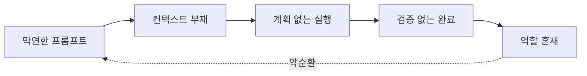

import { Callout, Cards } from 'nextra/components'

# 블록 2: 하네스 엔지니어링 실습

> **10:00~13:00 | 3시간 | 5개 세션**

## 바이브 코딩 vs 에이전틱 엔지니어링

같은 AI를 쓰더라도 접근 방식에 따라 결과가 달라진다.

| | 바이브 코딩 | 에이전틱 엔지니어링 |
|---|---|---|
| 맥락 전달 | 그때그때 프롬프트 | 구조화된 문서 (CLAUDE.md 등) |
| 품질 기준 | "돌아가면 OK" | 팀의 코드 리뷰 기준과 동일 |
| 경험 축적 | 개인 대화 히스토리에만 남음 | 팀 자산으로 공유·재사용 |
| 적합한 상황 | 탐색, 프로토타입, 1인 프로젝트 | 팀 개발, 프로덕션, 장기 유지보수 |

바이브 코딩이 틀린 게 아니다. 단, **팀 개발과 프로덕션 환경에서는 쌓이는 구조가 필요하다.** 그 구조가 하네스다.

---

## 핵심 개념: Agent = Model + Harness

> *"The performance of an agent is determined not just by the model, but by the harness around it — the context it receives, the plan it follows, and the feedback loops that let it self-correct."*
>
> — Birgitta Böckeler, [Harness engineering for coding agent users](https://martinfowler.com/articles/harness-engineering.html), Thoughtworks (2026.02.17)

**하네스(Harness)** 란 원래 말이 끄는 마구(馬具)에서 온 단어다. 말의 힘을 유용한 일로 향하게 하는 장치. AI 에이전트 맥락에서는 **LLM의 능력을 신뢰할 수 있는 작업으로 향하게 하는 모든 것**을 가리킨다.

같은 Claude를 쓰는데 누군가는 30분 만에 기능을 완성하고, 누군가는 두 시간째 이상한 코드와 씨름한다. 모델은 동일하다. **차이는 하네스에서 온다.**

---

## 흔한 안티패턴 5가지

하네스 없이 AI를 쓸 때 반복되는 패턴이다. 블록 1에서 뽑은 "이건 아니다" 경험 중 하나와 맞닿아 있을 것이다.

| 안티패턴 | 증상 | 원인 |
|---|---|---|
| **막연한 프롬프트** | 결과가 매번 다르고, 원하는 게 아님 | Context 없음 |
| **계획 없는 대규모 변경** | 예상치 못한 파일이 변경됨 | Plan 없음 |
| **AI 결과를 바로 신뢰** | 테스트해보니 동작하지 않음 | Verify 없음 |
| **매번 새 대화로 시작** | 같은 실수가 반복됨 | Compounding 없음 |
| **전체 설계를 AI에게 맡김** | 방향을 잃고 코드가 엉킴 | 사람의 역할 부재 |

이 5가지는 독립된 문제가 아니다. 하나를 놔두면 나머지가 줄줄이 따라온다.

**5가지는 하나의 뿌리: 하네스가 없다는 것.** 오늘 5세션에서 하나씩 해결한다.

📋 자가 진단 — 지금 내 상태는?

- [ ] AI에게 큰 작업을 통째로 던진 적이 있다
- [ ] 프로젝트에 CLAUDE.md 같은 컨텍스트 파일이 **없다**
- [ ] Plan Mode를 거의 안 쓴다
- [ ] AI가 "완료"라고 하면 그냥 믿는다
- [ ] 하나의 에이전트 세션으로 모든 걸 처리한다

3개 이상 체크 → 오늘 세션이 직접 도움이 된다.

---

## 오늘 배우는 5축

<Cards>
  <Cards.Card
    title="2-1 Context Engineering →"
    href="/block2/context"
  />
  <Cards.Card
    title="2-2 Plan-based Execution →"
    href="/block2/plan"
  />
  <Cards.Card
    title="2-3 Verification Loop →"
    href="/block2/verify"
  />
  <Cards.Card
    title="2-4 Token Optimization →"
    href="/block2/token"
  />
  <Cards.Card
    title="2-5 Multi-Agent →"
    href="/block2/multi-agent"
  />
</Cards>

| 축 | 핵심 질문 | 원칙 |
|---|---|---|
| **2-1 Context** | AI에게 어떤 맥락을 줄 것인가 | CLAUDE.md로 팀 컨벤션 주입 |
| **2-2 Plan** | 실행 전 계획을 사람이 검토하는가 | Plan Mode → 계획 승인 → Auto-accept |
| **2-3 Verify** | AI가 스스로 결과를 확인하는가 | Verification Loop = 품질 2~3배 |
| **2-4 Token** | 길어질수록 정확도가 떨어지는가 | 압축·분할·격리로 컨텍스트 관리 |
| **2-5 Multi-Agent** | 한 에이전트에 모든 역할을 맡기는가 | 역할 분리 = 컨텍스트 분리 |

5가지는 독립적인 기술이 아닙니다. **멀티에이전트는 앞의 4가지가 잘 갖춰졌을 때 자연스럽게 도달하는 형태**입니다.

> 출처: Birgitta Böckeler, [Harness engineering for coding agent users](https://martinfowler.com/articles/harness-engineering.html) (Thoughtworks, 2026)
> · Boris Cherny, [How Boris Uses Claude Code](https://howborisusesclaudecode.com) (2026)

---

<Callout type="info">
**공통 실습 환경**: `sds-harness-lab` Python 코드베이스를 사용합니다.
설치가 안 됐다면 [사전 준비](/setup)를 먼저 확인하세요.
</Callout>
