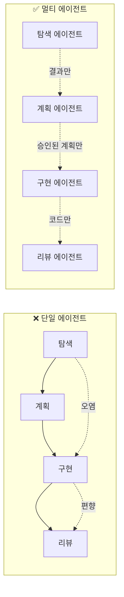
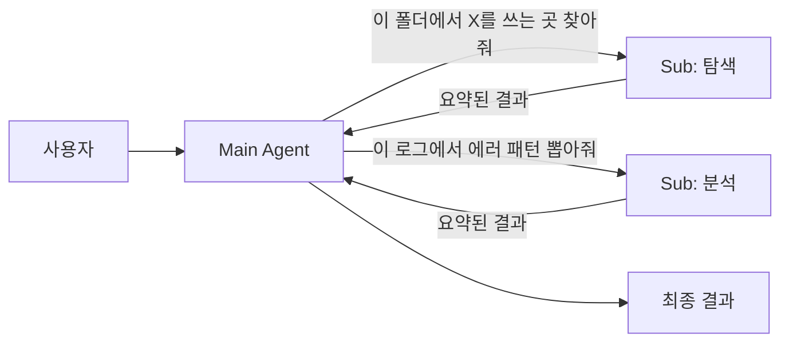
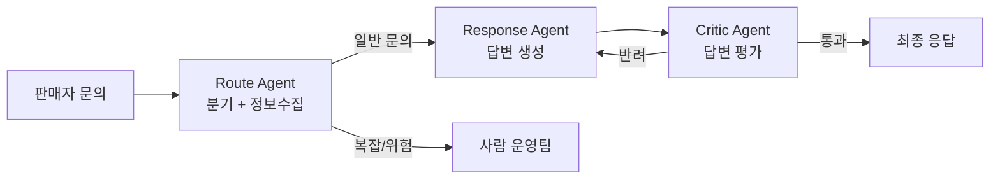

import { Callout, Steps, Tabs } from 'nextra/components'

# 2-5: Multi-Agent Orchestration

> **심화 | 블록 2 선택 학습**
>
> 역할을 나누는 힘 — "한 에이전트에 다 맡기지 않기"

## 한 명에게 다 맡기면 생기는 일

회사에서 한 사람에게 "기획·디자인·개발·QA·배포 다 해"라고 하면 어떻게 될까요?

AI 에이전트도 똑같습니다. 하나의 에이전트에게 "탐색 + 계획 + 구현 + 리뷰"를 다 시키면:

- **컨텍스트 오염** — 탐색할 때 쌓인 불필요한 정보가 구현까지 따라옴
- **역할 혼재** — 구현하던 사고방식으로 리뷰하면 자기 코드의 문제가 안 보임
- **윈도우 고갈** — 긴 작업일수록 토큰이 금방 바닥남

## 핵심 원리: "역할 분리 = 컨텍스트 분리"



**핵심은 "전달 인터페이스를 좁히는 것"입니다.** 각 에이전트는 앞 단계의 **결과**만 받고, 과정의 잡음은 버립니다.

---

## 3가지 실전 패턴

### 패턴 1: Plan / Implement / Review 분리

가장 기본이자 가장 강력한 패턴입니다.

| 에이전트 | 역할 | 주는 것 | 받는 것 |
|---|---|---|---|
| **Plan Agent** | 요구사항 → 작업 계획 | 요구사항·기존 코드 | 구조화된 플랜 |
| **Implement Agent** | 계획대로 구현만 | 승인된 플랜 | 코드 변경분 |
| **Review Agent** | 독립적 검증 | 변경분 + 플랜 | 리뷰 코멘트 |

Review Agent가 강력한 이유: Implement Agent의 사고 과정을 모릅니다. "왜 이렇게 짰는지"가 아니라 **"뭐가 이상한지"만** 봅니다. 이게 객관성입니다.

Claude Code에서의 구현:
```
# 새 세션 1 — Plan
Shift+Tab (Plan Mode)으로 계획만 받고 저장

# 새 세션 2 — Implement
계획 파일을 @참조하여 구현만 시킴

# 새 세션 3 — Review
변경분만 @참조하여 리뷰 (구현 과정은 안 줌)
```

### 패턴 2: Main + 서브에이전트 (탐색·검증 위임)

Main 에이전트는 전체 흐름을 지휘하고, 토큰을 많이 먹는 일은 서브에이전트에게 격리합니다.



서브에이전트의 컨텍스트는 작업 후 버려지고, Main의 윈도우는 **요약본만** 받아서 보호됩니다.

### 패턴 3: Route / Response / Critic (운영 자동화)

분기 판단 → 답변 생성 → 답변 검증을 분리합니다. 2-4(토큰 최적화)와 2-3(검증 루프)가 합류하는 지점입니다.

---

## 현장 사례: 당근 KAMP — 중고차 경매 에이전트

[당근의 GenAI 플랫폼 KAMP](https://medium.com/daangn/%EB%8B%B9%EA%B7%BC%EC%9D%98-genai-%ED%94%8C%EB%9E%AB%ED%8F%BC-ee2ac8953046)에서 중고차 경매 문의 처리를 **Route / Response / Critic 3개 역할로 분리**한 사례입니다.

**문제**: 판매자 문의가 운영팀에 집중. 단일 LLM으로 답하면 hallucination, 운영팀이 매번 수습.



**정량 결과:**
- 일당 평균 문의 수 **56% 감소**
- 피크일 문의 수 **72% 감소**
- 에이전트 생성 기간 2개월 → **15일**로 단축

> **단일 모델을 3개 역할로 쪼갠 것만으로 운영 부하가 절반 이하.**

이 사례가 보여주는 것: Context(Route가 맥락 정제) + Plan(Route의 분기 결정) + Verify(Critic의 독립 검증) + Token(각 에이전트 컨텍스트가 좁음)이 **동시에 작동**합니다.

---

## 5가지 축이 합류하는 지점

멀티 에이전트는 앞의 4가지가 모두 모이는 형태입니다:

| 축 | 멀티에이전트에서의 역할 |
|---|---|
| **2-1 Context** | 에이전트 간 전달할 컨텍스트를 좁게 정의 |
| **2-2 Plan** | Plan Agent가 계획, 나머지는 실행·검증만 |
| **2-3 Verify** | Review/Critic Agent가 독립적 검증 담당 |
| **2-4 Token** | 서브에이전트로 컨텍스트 격리 → 윈도우 보호 |
| **2-5 Multi-Agent** | 위 4가지가 동시에 작동하는 형태 |

> **멀티 에이전트는 별도 기술이 아닙니다. 하네스가 잘 만들어져 있을 때 자연스럽게 도달하는 형태입니다.**

---

## 실습

<Steps>
### 첫 걸음 질문 (5분)

> **"지금 하나의 에이전트에게 시키고 있는 일 중, 서로 다른 역할이 섞여 있는 건 뭔가?"**

그 하나를 둘로 분리하는 것 — 멀티에이전트의 첫 걸음입니다.

### Plan / Review 세션 분리 실습 (30분)

`sds-harness-lab`에서 새 기능을 추가하는 작업을 **두 세션**으로 나눕니다:

<Tabs items={['Claude Code', 'AI Pro']}>
  <Tabs.Tab>
    **세션 A — Plan만** (`Shift+Tab` → Plan Mode)
    ```
    complete_task 기능에 완료 날짜 기록을 추가해줘.
    계획만 보여줘. 코드는 아직 쓰지 마.
    ```
    계획을 파일로 저장: `plan.md`

    **세션 B — Review만 (새 세션)**
    ```
    @plan.md와 변경된 코드만 보고 리뷰해줘.
    구현 과정은 설명하지 않을게.
    - 계획과 실제 구현이 일치하는가?
    - 놓친 엣지 케이스가 있는가?
    ```
  </Tabs.Tab>
  <Tabs.Tab>
    **Chat 모드 — Plan만**
    ```
    complete_task 기능에 완료 날짜 기록을 추가해줘.
    먼저 계획만 보여줘. 코드는 쓰지 마.
    ```
    계획을 메모에 저장.

    **새 Chat — Review만**
    ```
    [계획 내용 붙여넣기]
    [변경된 코드 붙여넣기]

    위 계획과 코드만 보고 리뷰해줘.
    - 계획과 실제 구현이 일치하는가?
    - 놓친 엣지 케이스가 있는가?
    ```
  </Tabs.Tab>
</Tabs>

### 비교 (5분)

- Review Agent가 Implement Agent의 "의도"를 모르는 상태에서 찾은 문제가 있는가?
- 한 세션에서 리뷰할 때와 다른 결과가 나왔는가?
</Steps>

---

<Callout>
**세션 완료 체크**
- [ ] Plan / Review 세션 분리를 한 번 해봤다
- [ ] Review Agent가 구현 맥락 없이도 의미 있는 피드백을 내는지 확인했다
- [ ] "내 작업에서 역할이 섞인 것"을 하나 찾아냈다

**블록 3에서**: 오전에 익힌 5가지 원칙 중 내 업무 문제에 가장 맞는 것을 직접 적용합니다.

[블록 3 시작 →](/block3)
</Callout>
