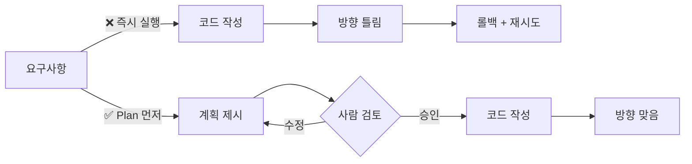

import { Callout, Steps, Tabs } from 'nextra/components'

# 2-2: Plan-based Execution


## 🤔 왜 계획이 먼저인가

Claude 4, GPT-5, Gemini 2.5 같은 reasoning 모델은 시키지 않아도 내부적으로 plan을 짭니다. 작업을 단계로 쪼개고 순서를 정해서 실행합니다. 그렇다면 Plan Mode가 굳이 필요할까요?

**필요합니다. 다만 이유가 달라졌습니다.** 예전엔 "AI가 plan을 못 짜서" 필요했고, 지금은 "AI가 plan을 짜지만 그게 black-box 안에 있어서" 필요합니다.

| | 내부 plan (모델 안) | 외부 plan (Plan Mode) |
|---|---|---|
| 어디에 존재하나 | 모델의 reasoning trace 안 | 화면에 텍스트로 노출 |
| 사람이 검토 가능? | ❌ 결과를 봐야 알 수 있음 | ✅ 실행 전 검토·수정 |
| 잘못된 방향 차단 | 사후 (코드를 다 만든 뒤) | 사전 (코드 작성 전) |
| 디버깅 reference | 없음 — 모델 결정 추정만 가능 | 있음 — plan과 실제 변경 대조 |
| 팀 협업 | 개인 대화에서만 살아있음 | PR 설명·리뷰 시 재사용 |

모델이 똑똑해질수록 오히려 **plan을 외부화해야 사람과 협업이 가능합니다.** AI에게 신중함을 의탁하는 게 아니라, 내가 보고 판단할 수 있는 자리에 plan을 꺼내놓는 것 — 그게 Plan Mode의 본질입니다.

> *"When the goal is to write a Pull Request, I use Plan mode and go back and forth with Claude until I like its plan. From there, I switch into auto-accept edits mode and Claude can usually 1-shot it. A good plan is really important!"*
>
> — Boris Cherny, [How Boris Uses Claude Code](https://howborisusesclaudecode.com) (2026)

외부화된 plan이 있으면:
- 범위가 화면에 명시됩니다 → 예상치 못한 변경이 사라집니다
- 순서가 텍스트로 잡힙니다 → 중간에 방향을 잃지 않습니다
- 검증 기준이 plan에 들어갑니다 → "완료"가 명확합니다

반면 plan을 외부화하지 않으면:
- AI가 어떤 추측을 했는지 사람이 모릅니다
- 추측이 틀려도 코드가 다 만들어진 다음에야 발견합니다
- 예상치 못한 파일이 슬쩍 변경됩니다



Plan Mode가 바꾸는 것: 잘못된 방향을 **조기에 차단**하고, 사람이 무엇을 원하는지 **말로 뱉어보게 만듭니다**. 요구사항의 불명확함을 AI가 아니라 **사람 스스로 발견**하게 됩니다.

---

## 🗺️ Plan Mode 사용법

<Tabs items={['Claude Code', 'AI Pro']}>
  <Tabs.Tab>
    ```
    Shift + Tab  →  Plan Mode 진입
    ```

    Plan Mode에서:
    1. 요구사항 입력
    2. Claude가 계획 생성
    3. **계획 검토** (범위 / 순서 / 검증 방법)
    4. 수정 요청 또는 승인
    5. 승인 후 → Auto-accept 모드로 전환하여 실행
  </Tabs.Tab>
  <Tabs.Tab>
    AI Pro의 계획 검토 기능을 사용합니다.
    요구사항 입력 → 계획 생성 → 검토 후 승인 → 실행
  </Tabs.Tab>
</Tabs>

---

## ⚖️ 좋은 계획 vs 나쁜 계획

| | 나쁜 계획 | 좋은 계획 |
|---|---|---|
| 파일 범위 | "관련 파일을 수정합니다" | `routers/projects.py`, `services/project_service.py`만 수정 |
| 순서 | 순서 없이 나열 | 1) 서비스 레이어 → 2) 라우터 → 3) 테스트 |
| 완료 기준 | 검증 방법 없음 | "완료 후 `pytest tests/ -v` 전체 통과" |
| 범위 | 건드릴 파일이 불명확 | "models.py는 변경하지 않음" 명시 |

**나쁜 계획의 공통점**: 사람이 읽어도 무엇을 승인하는지 모름 → 승인의 의미가 없어집니다.

계획이 마음에 들지 않으면 **승인 전에 수정 요청**하세요:

```
파일 변경 범위를 app/routers/projects.py와
app/services/project_service.py로만 제한해줘.
그리고 완료 후 어떻게 검증할지 계획에 추가해줘.
```

---

## 🧪 실습: Plan O/X 비교 (40분)

**동일한 요구사항**으로 두 가지 방식을 비교합니다.

> **요구사항**: 프로젝트 생성(POST /projects) 시 아래 규칙을 적용해주세요
> - `name`은 필수이며 빈 문자열을 허용하지 않습니다
> - `status`는 `todo`, `in_progress`, `done`, `archived` 중 하나여야 합니다
> - 위반 시 400 Bad Request + 구체적인 에러 메시지를 반환합니다

<Steps>
### 방식 A — Plan 없이 바로 실행 (15분)

```
프로젝트 생성 시 입력값 유효성 검증을 추가해줘.
name은 필수, status는 허용된 값만 받아야 해.
```

실행 후 기록:
- 변경된 파일 목록:
- 예상치 못한 변경이 있었나?
- 기존 동작이 깨진 게 있나?

<Callout type="warning" emoji="↩️">
방식 B 전에 변경사항을 되돌립니다:
```bash
git checkout .
```
</Callout>

### 방식 B — Plan Mode 먼저 (20분)

`Shift + Tab`으로 Plan Mode 진입 후 동일한 요구사항 입력.

계획이 나오면 **실행 전에** 확인:

- [ ] 변경할 파일 목록이 명시됐나?
- [ ] 변경 순서가 논리적인가?
- [ ] 완료를 어떻게 확인할지 포함됐나?
- [ ] 건드리지 말아야 할 파일을 건드리진 않나?

계획 승인 후 실행.

### 비교 (5분)

| | 방식 A | 방식 B |
|---|---|---|
| 변경된 파일 수 | | |
| 예상치 못한 변경 | | |
| 재작업 필요 여부 | | |
| 결과 예측 가능성 | | |
</Steps>

---

<Callout emoji="✅">
**세션 완료 체크**
- [ ] Plan Mode 진입 방법을 안다 (Shift+Tab)
- [ ] 계획에서 "검증 방법"이 없을 때 추가 요청할 수 있습니다
- [ ] 두 방식의 차이를 한 문장으로 설명할 수 있습니다
</Callout>

→ 다음: [2-3 Verification Loop](/block2/verify)
