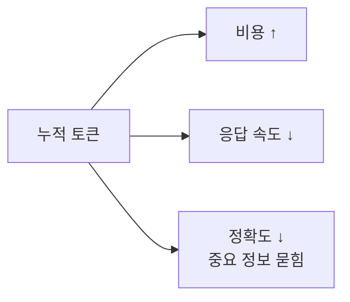

import { Callout, Steps, Tabs } from 'nextra/components'

# 2-4: Token & Context Optimization

> **심화 | 블록 2 선택 학습**
>
> 긴 작업에서 AI 품질이 왜 떨어지는지, 어떻게 유지하는지.

## 왜 토큰이 문제인가

AI 에이전트를 쓰다 보면 어느 순간 이상한 일이 생깁니다.

- 처음엔 똑똑하게 답하던 에이전트가
- 대화가 길어지면 같은 말을 반복하거나
- 방금 내린 결정을 까먹거나
- "이 파일을 다시 읽어볼게요"를 10번째 반복함

에이전트가 멍청해진 게 아닙니다. **컨텍스트 윈도우가 고갈되고 있는 것**입니다.

LLM은 매 턴마다 지금까지의 모든 대화 + 시스템 프롬프트 + 도구 호출 결과를 다시 읽습니다.



**토큰은 세 가지를 동시에 잡아먹습니다: 시간·돈·정확도.**

> **"Lost in the Middle"** (Stanford·UC Berkeley, 2023): 컨텍스트가 길어질수록 중간에 있는 정보는 흐려집니다. 윈도우가 크면 다 된다는 건 오해입니다. 큰 윈도우는 만능이 아니라 **안전 마진**입니다.

---

## 3가지 전략

### 전략 1: 압축 (Compression)

긴 작업 중간에 핵심만 남기고 나머지를 버립니다.

<Tabs items={['Claude Code', 'AI Pro']}>
  <Tabs.Tab>
    ```
    /compact
    ```
    현재 대화를 핵심 결정만 남긴 요약으로 압축합니다.

    **언제**: 긴 디버깅이 끝나고 "이제 다른 작업으로 넘어갈 때"
  </Tabs.Tab>
  <Tabs.Tab>
    히스토리 아이콘 → **New Chat**으로 새 세션 시작.
    Pre-set Prompt에 "지금까지 결정한 것: `{요약}`"을 넣어 컨텍스트를 재진입합니다.
  </Tabs.Tab>
</Tabs>

### 전략 2: 분할 (Chunking)

큰 작업을 작은 작업으로 쪼개 각각 독립 세션으로 진행합니다.

| ❌ 한 세션에 다 | ✅ 세션 분할 |
|---|---|
| "이 모듈 전체 리팩터링" | 1) 타입 정의 → 2) 유틸 분리 → 3) 메인 로직 (각 세션) |
| 중반쯤 가면 컨텍스트 고갈 | 각 세션이 fresh하게 시작 |
| 앞 결정을 뒤에서 까먹음 | 결정은 커밋 메시지·CLAUDE.md에 기록 |

세션 간 연속성은 **산출물(코드·문서·CLAUDE.md)** 로 유지합니다. 대화 히스토리가 아닙니다.

### 전략 3: 격리 (Isolation)

토큰을 많이 먹는 작업(코드베이스 탐색, 긴 로그 분석, 큰 문서 요약)을 **서브에이전트에게 위임**합니다. 서브에이전트의 컨텍스트는 작업 후 버려지고, Main은 **요약본만** 받습니다.

> **"Sub-agents function as a context firewall that ensures discrete tasks can run in isolated context windows so none of the intermediate noise accumulates in your parent thread."**
>
> — HumanLayer, [Skill Issue: Harness Engineering for Coding Agents](https://www.humanlayer.dev/blog/skill-issue-harness-engineering-for-coding-agents)

이게 2-5 멀티에이전트와 맞닿는 지점입니다. **토큰 절약의 가장 효과적인 방법은 에이전트 분리입니다.**

---

## 흔한 오해 3가지

| 오해 | 실제 |
|---|---|
| "컨텍스트 윈도우가 크면 다 되는 거 아닌가?" | 중간 정보는 흐려짐. 큰 윈도우는 안전 마진이지 만능이 아님 |
| "일단 다 넣고 알아서 골라 쓰라고 하면 되지" | 불필요한 정보가 많으면 AI가 그 중 일부를 "중요해 보이는 것"으로 착각함 |
| "토큰 아끼기는 비용 이슈 아닌가?" | 비용보다 **정확도와 속도**가 더 큰 영향 |

**"덜 주는 게 더 잘 되는 역설"** — CLAUDE.md를 200줄로 제한하는 이유가 바로 이것입니다.

---

## 실습

<Steps>
### Step 1 — 긴 세션 패턴 관찰 (10분)

오늘 블록 2 실습에서 했던 세션을 돌아보세요:

- AI가 같은 파일을 여러 번 다시 읽은 적이 있었나?
- 대화가 10턴 이상 됐을 때 초반보다 결과 품질이 달라졌나?
- "방금 전에 말한 것"을 AI가 무시한 순간이 있었나?

### Step 2 — `/compact` 또는 세션 분할 적용 (20분)

현재 진행 중인 실습 세션에서:

<Tabs items={['Claude Code', 'AI Pro']}>
  <Tabs.Tab>
    ```
    /compact
    ```
    를 실행하고, 압축 후 같은 요구사항을 다시 넣어 결과가 달라지는지 확인.
  </Tabs.Tab>
  <Tabs.Tab>
    새 Chat을 시작하고, CLAUDE.md에 "지금까지 결정한 것"을 추가한 뒤 재진입.
    이게 세션 분할입니다.
  </Tabs.Tab>
</Tabs>

### Step 3 — CLAUDE.md에 세션 경계 규칙 추가 (10분)

```markdown
## 세션 관리
- 작업이 5턴 이상 이어지면 /compact 후 새 세션으로 분리한다
- 세션 간 이어지는 결정은 이 파일의 "최근 결정" 섹션에 기록한다
```
</Steps>

---

<Callout>
**세션 완료 체크**
- [ ] 긴 세션에서 컨텍스트 고갈 증상을 직접 관찰했다
- [ ] `/compact` 또는 세션 분할을 한 번 이상 써봤다
- [ ] CLAUDE.md에 세션 경계 규칙을 추가했다

다음: [2-5 멀티에이전트 →](/block2/multi-agent)
</Callout>
