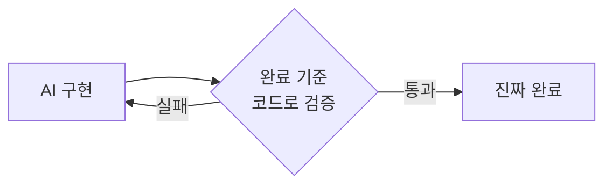

import { Callout, Steps, Tabs } from 'nextra/components'

# 2-3: Verification Loop

> **12:00~13:00 | 강의 20분 + 실습 40분**

## #1 팁

> *"Give Claude a way to verify its work. If Claude has that feedback loop, it will 2-3x the quality of the final result."*
>
> — Boris Cherny (Claude Code 창시자), [How Boris Uses Claude Code](https://howborisusesclaudecode.com) (2026)

검증 루프가 없으면:
- AI가 "완료했습니다"라고 해도 실제로 동작하는지 모른다
- 에러가 숨겨진 채로 코드가 쌓인다
- 사람이 매번 수동으로 확인해야 한다

검증 루프가 있으면:
- AI가 테스트를 실행하고 실패하면 **스스로 수정**한다
- 사람은 최종 결과만 검토하면 된다
- 품질이 2~3배 올라간다

---

## 검증 루프의 종류

| 종류 | 예시 | 효과 |
|---|---|---|
| 테스트 실행 | `pytest tests/ -v` | 로직 정확성 |
| 빌드 확인 | 컴파일 성공 여부 | 문법 오류 제거 |
| 정적 분석 | mypy, flake8 | 타입/스타일 |
| 실행 확인 | 서버 기동 후 API 호출 | 통합 동작 |

---

## CLAUDE.md에 검증 방법 추가

세션 2-1에서 작성한 CLAUDE.md에 아래 항목을 **지금 추가**하세요:

```markdown
## 검증 방법
- 테스트 실행: `python3 -m pytest tests/ -v`
- 작업 완료 후 반드시 모든 테스트가 통과해야 한다
- 새 기능을 추가할 때 테스트를 함께 작성한다
```

이 항목이 있으면 Claude가 작업 후 **스스로 테스트를 실행**한다.

---

## "완료"의 정의를 코드로 만들기

AI 에이전트가 "완료했습니다"라고 말할 때, 그 완료 기준은 누구의 것인가?
대부분의 경우 — 에이전트가 스스로 판단한 것입니다. 그 판단은 자주 틀립니다.



**완료 기준을 코드로 만드는 도구:**
- **테스트** — 기능이 의도대로 동작하는가
- **훅(Hook)** — 커밋 전 자동 검증 (lint, type, format)
- **리뷰 에이전트** — 코드 품질·일관성 독립 검토

훅 예시 시나리오:
1. AI가 코드 수정
2. pre-commit 훅이 자동으로 `pytest` 실행
3. 실패 시 → 커밋 차단, AI에게 에러 전달
4. AI가 수정 → 재검증 → 통과해야 진행

훅은 **"방심의 비용"을 0으로** 만듭니다.

---

## "기록 → 검증 → 도구" 3단계 승격 파이프라인

AI가 만든 코드를 어떻게 팀 자산으로 만드는가?


| 단계 | 의미 | 통과 조건 |
|---|---|---|
| **1. 기록 (Implement)** | 일단 돌아가는 코드 | AI가 생성한 결과물 |
| **2. 검증 (Verify)** | 테스트·리뷰로 재현성 확인 | 내가 없어도 성공하는가? |
| **3. 도구 (Productize)** | 공통 모듈·라이브러리·CLAUDE.md 등록 | 팀 누구나 재사용 가능한가? |

> **모든 AI 결과물이 자산이 되는 게 아닙니다. 검증된 것만 올라갑니다.**

에이전트가 뱉은 코드는 전부 **1단계(기록)** 일 뿐입니다. 거기서 멈추면 축적되지 않습니다. CLAUDE.md의 "자주 하는 실수" 섹션은 2단계를 거친 것만 기록합니다.

---

## TDD × 에이전트

> *테스트를 먼저 작성하고, 그 테스트를 통과하는 구현을 AI에게 맡기는 패턴.*

사람이 "무엇이 올바른가"를 테스트로 정의하고,
AI가 "어떻게 구현할 것인가"를 담당한다.

```
1. 사람: 테스트로 완료 기준 정의
2. AI: 테스트가 통과할 때까지 구현
3. 사람: 최종 코드 검토
```

이 패턴이 강력한 이유:
- 테스트 = 명확한 완료 기준 → 계획에서 검증 방법이 자동으로 해결됨
- AI가 실패하면 스스로 수정 → 사람의 개입 최소화
- 테스트가 남는다 → 이후 변경에서 회귀 방지

> Anthropic 공식 코스 "Claude Code in Action"의 핵심 실습 패턴.
> 출처: [Claude Code in Action](https://anthropic.skilljar.com/claude-code-in-action) (2026)

---

## 실습 (40분)

<Steps>
### Step 1 — CLAUDE.md에 검증 방법 추가 (5분)

위 내용을 `sds-harness-lab/CLAUDE.md`에 추가합니다.

### Step 2 — 검증 루프 연결 실습 (20분)

```
complete_task 함수에 대한 단위 테스트를 작성해줘.
테스트 작성 전에 이 함수가 어떤 동작을 해야 하는지
먼저 설명해줘.

테스트 작성 후 python3 -m pytest를 직접 실행하고,
실패하면 코드를 수정해서 통과시켜줘.
모든 테스트가 통과할 때까지 반복해줘.
```

관찰할 것:
- AI가 테스트 실행 결과를 보고 스스로 수정하는가?
- 몇 번의 시도 만에 통과하는가?
- AI가 발견한 버그가 있나? (None 처리 등)

### Step 3 — TDD 패턴 (15분)

테스트를 먼저 정의하고, 구현을 맡깁니다:

```
create_project 함수에 대해 두 가지 테스트를 작성해줘:
1. name이 빈 문자열이면 ValueError가 발생해야 한다
2. status가 허용 목록에 없으면 ValueError가 발생해야 한다

테스트를 먼저 작성하고,
그 테스트가 통과하는 구현을 완성해줘.
완료 후 pytest로 전체 테스트를 실행해줘.
```

<Callout type="info">
**프롬프트 팁**: "테스트를 먼저 작성하고"라는 순서 지시가 중요합니다.
순서를 명시하지 않으면 AI가 구현부터 하고 테스트를 나중에 작성하는 경향이 있습니다.
</Callout>
</Steps>

---

<Callout>
**세션 완료 체크**
- [ ] `tests/` 디렉터리에 테스트 파일이 생성됐다
- [ ] `pytest tests/ -v`를 실행하면 테스트가 통과한다
- [ ] CLAUDE.md에 검증 방법이 명시돼 있다
- [ ] AI가 스스로 테스트를 실행하고 수정하는 것을 관찰했다

**점심 후 블록 3에서**: 오전에 익힌 3가지 패턴을 본인의 업무 문제에 직접 적용합니다.

[블록 3 시작 →](/block3)
</Callout>
